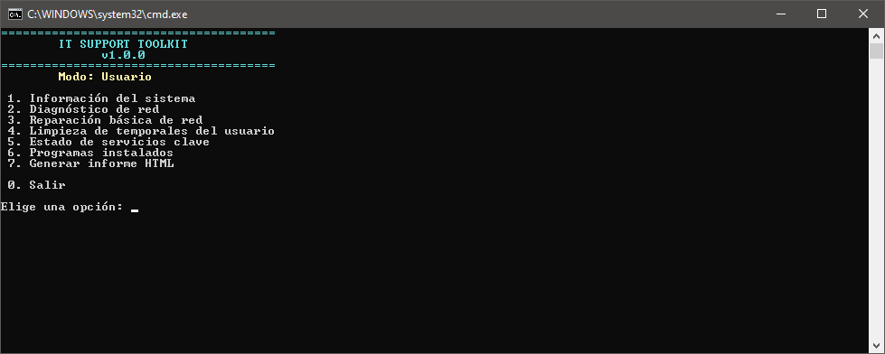
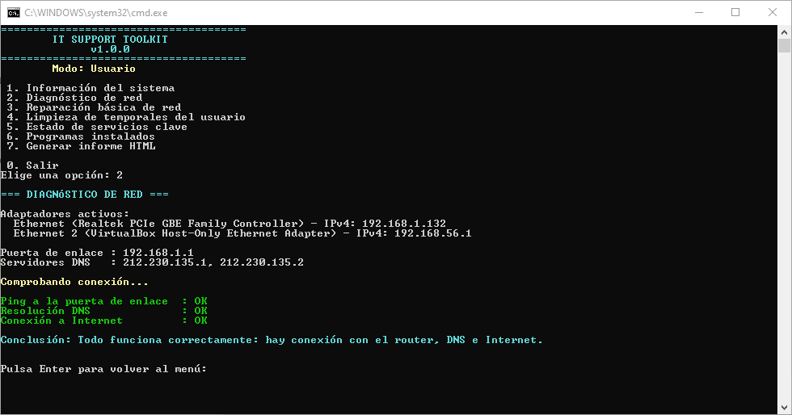
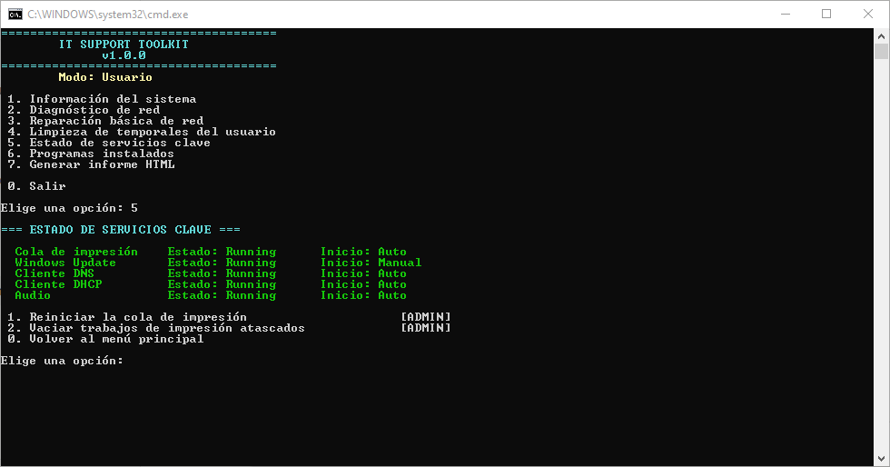
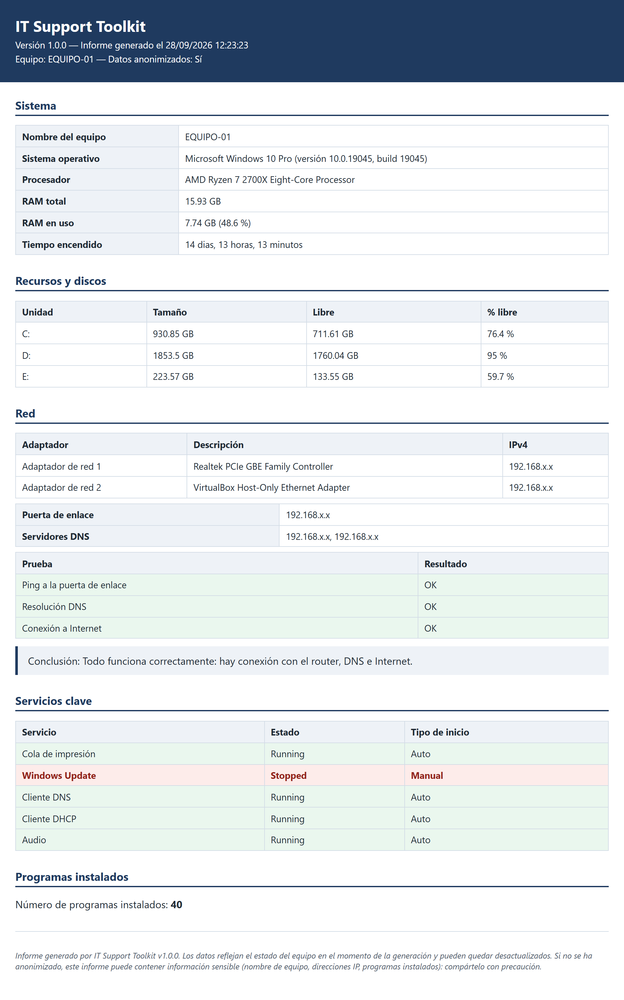

# IT Support Toolkit

**Versión 1.0.0**

Herramienta en PowerShell 5.1 para técnicos de soporte N1 en Windows: reúne
en un único menú interactivo las tareas de diagnóstico y mantenimiento más
habituales (información del sistema, diagnóstico y reparación básica de
red, limpieza de temporales, servicios clave, inventario de software e
informes). Pensada como proyecto de portfolio, pero utilizable en el día a
día de un técnico N1.

## Para quién es

Para cualquiera que dé soporte técnico básico a equipos Windows 10/11 y
quiera reunir en un solo sitio las comprobaciones más habituales de una
primera revisión, sin tener que escribir comandos de PowerShell a mano.

## Funciones

1. **Información del sistema** — hostname, edición y versión de Windows,
   CPU, RAM total/usada, discos (con aviso si queda menos del 15 % libre) y
   tiempo desde el último arranque.
2. **Diagnóstico de red** — adaptadores activos, IPv4, puerta de enlace,
   servidores DNS; pruebas de ping a la puerta de enlace, resolución DNS y
   conexión a Internet, con una conclusión en lenguaje claro.
3. **Reparación básica de red** `[ADMIN]` — vaciar la caché DNS (no
   requiere administrador); renovar la concesión DHCP del adaptador
   principal y reiniciar dicho adaptador (ambas requieren administrador).
4. **Limpieza de temporales del usuario** — borra los archivos de `%TEMP%`
   con más de 24 horas de antigüedad, mostrando antes el espacio ocupado y
   pidiendo confirmación; los archivos en uso se omiten sin detener el
   proceso.
5. **Estado de servicios clave** — Cola de impresión, Windows Update,
   Cliente DNS, Cliente DHCP y Audio; permite reiniciar la cola de
   impresión y vaciar trabajos de impresión atascados `[ADMIN]`.
6. **Programas instalados** — listado leído del registro (solo lectura),
   exportable a CSV.
7. **Informe HTML** — genera un informe autónomo (sin JavaScript ni
   recursos externos) con los datos de las opciones 1, 2, 5 y 6, con la
   posibilidad de anonimizar los datos identificativos antes de
   compartirlo.

## Capturas


*Menú principal, con la versión y el modo (usuario/administrador).*


*Diagnóstico de red con la conclusión del diagnóstico.*


*Submenú de servicios clave.*


*Informe HTML generado en modo anonimizado.*

## Requisitos

- Windows 10 u 11.
- Windows PowerShell 5.1 (el que viene instalado por defecto). No requiere
  PowerShell 7 ni módulos externos: solo usa los módulos que trae Windows
  (`NetTCPIP`, `DnsClient`, `CimCmdlets`, etc.).

## Cómo ejecutarlo

- **Modo usuario**: doble clic en `Iniciar.bat`. Ejecuta el script con
  `-ExecutionPolicy Bypass` solo para esa ejecución, sin modificar la
  configuración de PowerShell del sistema. En este modo se pueden usar
  todas las opciones de solo lectura y las que no requieren administrador
  (vaciar caché DNS, limpieza de temporales, exportar CSV, generar el
  informe HTML).
- **Modo administrador**: doble clic en `Iniciar como administrador.bat`.
  Pide elevación de permisos (UAC) y permite además las acciones marcadas
  `[ADMIN]`. Si se ejecuta en modo usuario e intentas una acción `[ADMIN]`,
  el programa te explica que hace falta administrador y cómo relanzarlo, sin
  detener el resto del menú.

### Acciones que requieren administrador

- Renovar la concesión DHCP del adaptador principal (opción 3).
- Reiniciar el adaptador de red principal (opción 3).
- Reiniciar la cola de impresión (opción 5).
- Vaciar trabajos de impresión atascados (opción 5).

Todas las demás opciones (1, 2, 4, 6, 7 y "vaciar caché DNS" de la opción 3)
funcionan en modo usuario.

## Seguridad

Todas las acciones son de solo lectura por defecto. Cualquier acción que
vaya a modificar el sistema pide confirmación explícita (S/N) antes de
ejecutarse, y ningún comando se construye a partir de texto libre
introducido por el usuario.

**Qué hace** (acciones que modifican algo, siempre con confirmación previa):
vaciar la caché DNS local, liberar/renovar la IP (DHCP) del adaptador
principal, desactivar y reactivar dicho adaptador, borrar archivos
temporales de más de 24 horas en `%TEMP%`, reiniciar la cola de impresión y
borrar trabajos de impresión pendientes.

**Qué NUNCA hace**:
- No cambia la configuración IP del equipo (no fija IPs, DNS ni puertas de
  enlace; solo renueva la concesión DHCP existente o reinicia el adaptador).
- No modifica el registro de Windows: la opción 6 solo lee las claves
  `Uninstall` para listar programas.
- No se conecta a Internet salvo las pruebas declaradas en la opción 2 (y
  reutilizadas en el informe de la opción 7): ping a la puerta de enlace,
  resolución DNS de `www.google.com` y comprobación de conexión a
  `8.8.8.8` por el puerto 443.
- No desinstala programas, no ejecuta reparaciones de sistema (SFC/DISM) ni
  accede a otros equipos de forma remota.

## Dónde se guardan los datos

- **Logs** de todas las acciones relevantes (incluidas las de solo
  lectura): `%LOCALAPPDATA%\ITSupportToolkit\logs\ITSupportToolkit_AAAAMMDD.log`
  (un archivo por día).
- **Informes y exportaciones**: `Documentos\IT Support Toolkit Reports\`
  — ahí se guardan tanto el CSV de programas instalados
  (`ProgramasInstalados_AAAAMMDD_HHMMSS.csv`) como el informe HTML
  (`informe-AAAAMMDD-HHMMSS.html`).

## Estructura del proyecto

```
Iniciar.bat                          Lanzador (modo usuario)
Iniciar como administrador.bat       Lanzador con elevación UAC
src/
  ITSupportToolkit.ps1    Menú principal
  modules/
    Logging.psm1          Registro de acciones en log
    Common.psm1           Utilidades compartidas (admin, confirmaciones, versión)
    SystemInfo.psm1        Opción 1: información del sistema
    Network.psm1            Opción 2: diagnóstico de red / Opción 3: reparación
    Cleanup.psm1              Opción 4: limpieza de temporales
    Services.psm1              Opción 5: servicios clave
    Software.psm1                Opción 6: programas instalados
    Report.psm1                    Opción 7: informe HTML
docs/
  screenshots/            Capturas de pantalla (README)
  pruebas.md              Plan de pruebas manuales e incidencias encontradas
PROJECT_SPEC.md            Alcance completo del proyecto
CHANGELOG.md                Historial de cambios
```

## Limitaciones

- El listado de programas instalados se basa en las claves `Uninstall` del
  registro; no incluye aplicaciones de Microsoft Store (UWP) ni componentes
  marcados como parte del sistema.
- El diagnóstico de red asume una configuración de red doméstica u oficina
  sencilla (una única puerta de enlace por defecto); en entornos con
  enrutamiento avanzado los resultados pueden no reflejar toda la topología.
- No hace reparaciones de sistema (SFC/DISM), no desinstala software ni
  gestiona equipos remotos: eso queda fuera del alcance de esta v1.0.0 (ver
  `PROJECT_SPEC.md`).
- La interfaz está solo en castellano.

## Licencia

MIT. Ver [LICENSE](LICENSE).

## Autor

Iván Marcos Couso
